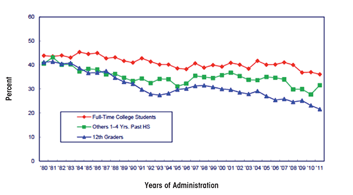

# Student Alcohol Consumption Data Visualization Set

### Here we compile the student alcohol comsumption data from different datasets and other interesting sources.

# Max's Webpage:
I am interested in examining the role of drinking and academic motivation. To start the examinations I am going to use a student-alcohol consumption dataset that took place in [Portugal](https://www.kaggle.com/uciml/student-alcohol-consumption?select=student-por.csv). My first major investigation is going to look into the correlations between drinking and students decisions for choosing the specific College.
# Visualizations and Jupyter Notebooks:

# Dataset Trajectory and Information:
So far what I have done to investigate this dataset, is I separated it between two areas where I think we can find out a lot about drinking, and other factors. 
## First, 
To start, I wanted to investigate the role of alcohol, and student choice for their college. The dataset did not have too much information regarding this, but in that column it had the decisions of either: Proximity to home, Course Choice, the college's reputation, or other. The other column definitely holds a lot of ambiguity and different reasonings, such as financial, or social, but the the choices did seem to articulate some sort of reputation/ character that might influence alcohol consumption and overall success. So to start, I wanted to investigate the role of choosing the college and class failure rates. 
Here is a histogram showing this:

What's interesting to note here is that there is a slight correlation between course choice and failures, which might indicate many things, either that there wasn't enough motivation for the given course, or that the course choice was one of hard ability. Second in failure rates was the other column, which is interesting. 

Now, let us look to the Daily Alcohol consumption of students and its correlation to reasoning for the college the student chose.

Investigating this, we do see a correlation between picking the college based on its reputation and lower drinking rates, where the students that picked the school for reputation have less rates of high drinking habits. With that, to then investigate the other side, we do see rates where home and other reasoning have the highest rates of drinking, where depending on which level of the scale, those two choices alter between highest rates. With this information, it still seems unclear however if there is much correlation between these two different motives and connections. So let us theorize and investigate possible other contributors that could help with this notion of motivation and influence in relation to daily drinking habits. 

## Second:
With this next investigation, we will find out about romantic interest and student motivation/ drinking habits. As said, it is hard to tell if there is relationship between motivation, drinking, and relationships, but there is major research in [peer influences](https://www.alcohol.org/teens/peer-pressure-drinking/) and drinking, Thus I find this notion of relationships to be a cool way to investigate and question the given data to see if we can speculate any given correlation. Here is the graph that shows student drinking habits and romantic relationships.

As we can see, this does show a slight correlation between being in a relationship, and drinking more. This actually does make sense, as in when in a relationship, there is a societal connotation of more social life, and thus more time to drink, and more time to be with a significant other. 

## Third
Lastly, I also wanted to investigate the role of parent guardians and alcohol consumption, since I was also curious to see if that had a role. Here is a Histogram that shows the results:

As you can see with these results there also does seem to be a correlation between non-parental guardians and higher drinking habits.

## Overall Results and Data Analysis:
With all of this information, we definitely can see trends of stress and social influence that effect the amount of drinking that students. It is hard to fully deduct reasoning, but it does seem that there is correlation between motivation, romantic life, and family relations that can relate to the amount students drink

# Other Interesting Material:
Here is a graph that shows students and alcohol trends between 1980 and 2011

To continue this investigation, I found this article interesting since it examines the role of substance abuse and [divorce](https://www.projectknow.com/parents-guide/divorce-and-substance-abuse/)

Here is also another article, discussing the reasoning that might exist when college students [drink](https://www.ncbi.nlm.nih.gov/pmc/articles/PMC4214145/)