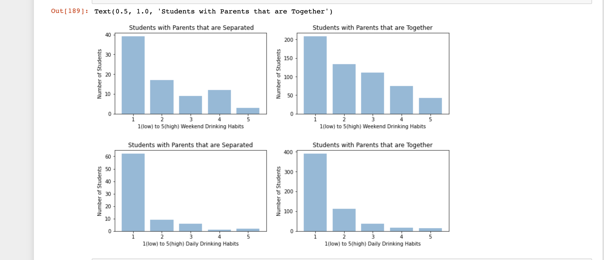
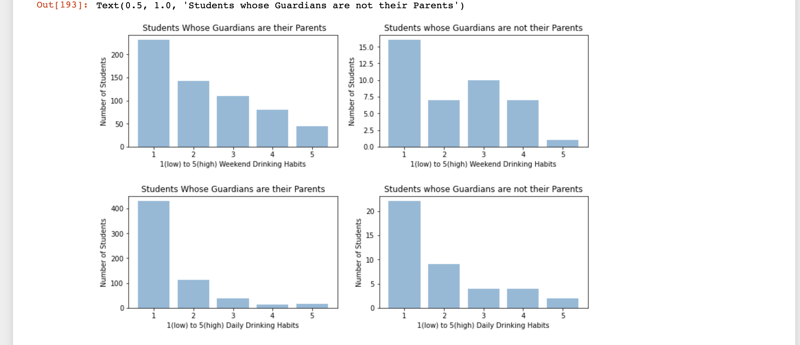

# Student Alcohol Consumption Data Visualization Set

### Here we compile the student alcohol comsumption data from different datasets and other interesting sources.

## Max's Webpage:
I am interested in examining the role of drinking and academic and family life influence in college. To start the examinations I am going to use a student-alcohol consumption dataset that took place in [Portugal](https://www.kaggle.com/uciml/student-alcohol-consumption?select=student-por.csv). My first major investigation is going to look into the correlations between drinking and family home-life. 
## Visualizations and Jupyter Notebooks:
[Student Alcohol Consumption Visual](Visualizations)

## Dataset Trajectory and Information:
So far what I have done to investigate this dataset, is I separated it between two areas where I think we can find out a lot about drinking, and other factors. 
# First,
 I wanted to see if there was a trajectory or evidence that could show the effect of the students reasoning for picking the university that they are at when this study started. Here is a bar chart that will show what these trends look like depending on the options.

I will be interested and need to do more work in further investigating this notion, along with some of the other columns that can be involved when in investigating this.

# Second
I was interested in investigating homelife, particularly on whether having divorced or together parents, or if the students specific guardian was or was not their parents. Here is another bar chart collection that shows the results.

For this, I find that there could be more actual relationships, and with this, I think it could be fascinating to also look into jobs, and wealth since I think all of these factors could indicate possible habits. 

## Other Interesting Material:
Here is a graph that shows students and alcohol trends between 1980 and 2011

To continue this investigation, I found this article interesting since it examines the role of substance abuse and [divorce](https://www.projectknow.com/parents-guide/divorce-and-substance-abuse/)

Here is also another article, discussing the reasoning that might exist when college students [drink](https://www.ncbi.nlm.nih.gov/pmc/articles/PMC4214145/)