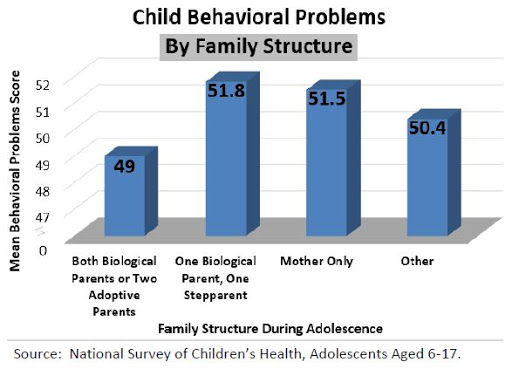

# Ethan's Webpage

## Project:
I am interested in looking at how family dynamics impact student alcohol consumption.  Our dataset has information about the family, including the education and job experience of both parents.

Additionally, I am interested in learning more about how the use of alcohol affects an individual and the various aspects of their lives.  I expect there to be a negative effect of alcohol use on various academic outputs, as alcohol is generally considered to be bad for productivity.
### Datasets:
* [Student Alcohol Consumption](https://www.kaggle.com/uciml/student-alcohol-consumption)
-- This Dataset has information about student alcohol consumption in Portugal, and contains information about the family environments of the students
* [Global Alcohol Consumption](https://data.world/fivethirtyeight/alcohol-consumption)
-- This Dataset from the World Health Organization contains information about the average annual per capita alcohol consumption of different countries in the world, separated by type of alcoholic beverage.

## Visualizations:

### Parental Separation Vs. Cohabitation.
This histogram compares the relative weekly alcohol consumption of students whose parents live together and apart.


### Effect on School Attendance
This bar chart shows the number of absences by each group of alcohol use.  Somewhat surprisingly, there are more absences in the 4/5 alcohol group than the 5/5 alcohol group, which could be a fact of there simply being more people that can be classified as 4/5 than 5/5.  There are 51 students in the 4/5 category, while there are only 28 in the 5/5 group.


### Effect on Future Goals
This histogram, for each group, shows the relative percentages of those in that category who do wish to pursue higher learning, and those who do not.  I expected to see a decrease in higher learning aspirations as alcohol consumption increased, and I was not surprised to see this relationship reflected in the data.


### Global Alcohol Consumption
This is an interactive Choropleth that shows the annual average per capita alcohol consumption of different countries around the world.  This is interesting, as we see that Portugal, the country from the other dataset, consumes 2.3 more liters of pure alcohol per year than the United States.  This suggests that while in the United States we may have similar effects as the data from Portugal show, but likely to a lesser extent as we consume less alcohol on average.


## Coming Soon:
In the final week of class, I want to find another data set that provides more information connecting the role of the parents on child alcohol use.  I am also curious about family history for alcoholism, and how that may affect the academic outcomes of their children.  For example, it appears that as high school students use alcohol more, they are less likely to want to go to college.  Going further, I am curious if those students who are using alcohol at higher rates have a family history of alcoholism, or if there are other factors that led to their situation.

## Other Research
This visualization from [Marripedia](http://marripedia.org/effects.of.divorce.on.children.s.behavior) shows that children whose parents are separated have higher behavioral problem scores.

This [article](https://www.verywellmind.com/the-effects-of-parental-alcoholism-on-children-67233) talks about the many impacts that parental alcoholism can have on children.

This research relates to my next question, as there are clear psychological effects of alcoholism in the family.  In addition to a distorted attitude towards alcohol, other psychological issues created by alcoholism may potentially lead children to worse academic outcomes, even if they are not drinking at high levels.
